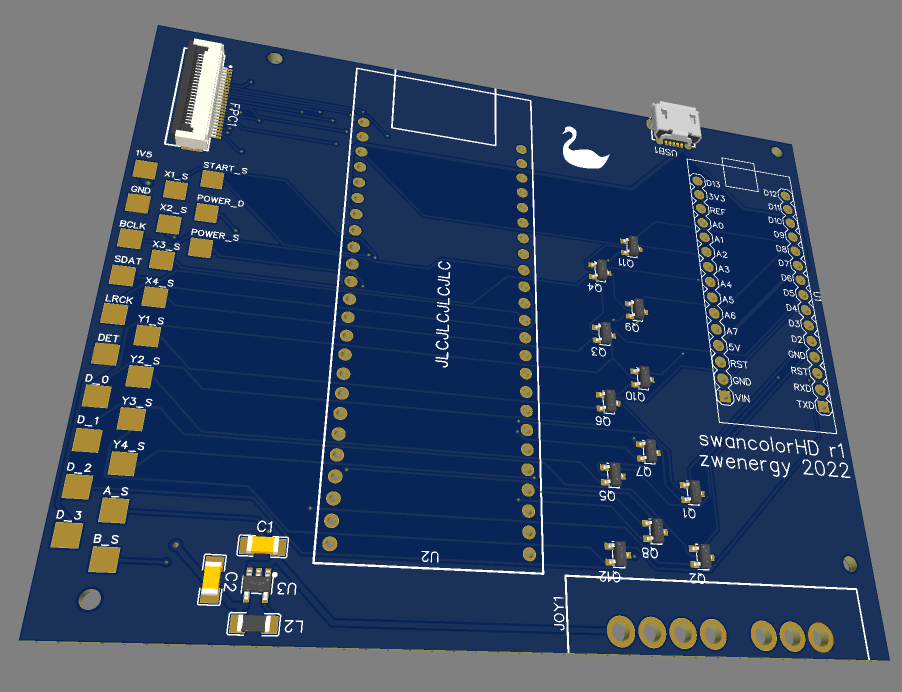
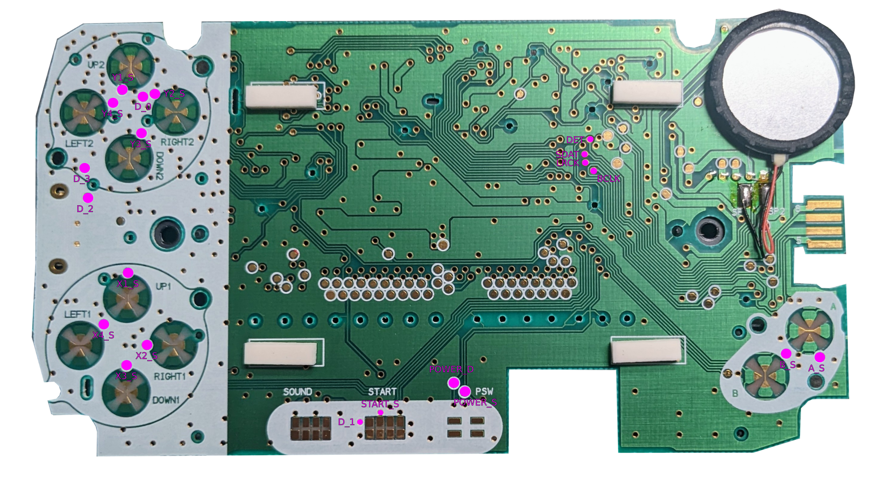

# swancolorHD
An open-source WonderSwan Color consolizer.

This project is in a somewhat usable stage right now.
Additionally, it needs the video core from sameer, to be [found here](https://github.com/hdl-util/hdmi).

## About
This project is an open-source consolizer for the WonderSwan Color handheld, based on a Tang Nano 9k FPGA board (which has a GW1NR-LV9QN88P FPGA on it).

## PCB

### PCB BOM
| **Reference** | **Part** | **Link** |
---------|------|------|
|FPC1    | FFC connector with 24 pins, 0.5mm pitch, bottom contacts | [LCSC](https://lcsc.com/product-detail/FFC-FPC-Connectors_XUNPU-FPC-05F-24PH20_C2856805.html)|
|U1      | Arduino Nano | [AliExpress](https://aliexpress.com/item/1005002966043359.html)|
|U2      | Tang Nano 9k | [AliExpress](https://aliexpress.com/item/1005004275570427.html)|
|U3      | TPS62221DDCR | [LCSC](https://lcsc.com/product-detail/DC-DC-Converters_Texas-Instruments-TPS62221DDCR_C398348.html)|
|USB1    | Micro USB connector | [LCSC](https://lcsc.com/product-detail/USB-Connectors_XKB-Connectivity-U254-051T-4BH23-S2S_C482361.html)|
|JOY1    | SNES controller connector 90° | [AliExpress](https://aliexpress.com/item/32895254743.html)|
|C1      | 4.7 uF capacitor (1206) | [LCSC](https://lcsc.com/product-detail/Multilayer-Ceramic-Capacitors-MLCC-SMD-SMT_FH-Guangdong-Fenghua-Advanced-Tech-1206B475K500NT_C29823.html)|
|C2 | 10 uF capacitor (1206) | [LCSC](https://lcsc.com/product-detail/Multilayer-Ceramic-Capacitors-MLCC-SMD-SMT_Samsung-Electro-Mechanics-CL31A106KBHNNNE_C13585.html)|
|L2 | 10 uH inductivity (1206) | [LCSC](https://lcsc.com/product-detail/Inductors-SMD_FH-Guangdong-Fenghua-Advanced-Tech-CMI321609X100KT_C1051.html)|
|Q1 - Q12 | N-channel MOSFET 2N7002 (SOT-23) |[LCSC](https://lcsc.com/product-detail/MOSFETs_Jiangsu-Changjing-Electronics-Technology-Co-Ltd-2N7002_C8545.html)|

## PCB Wiring Diagram
Check the [wiring diagram from WSC motherboard to PCB in the assets folder](./assets/wiring.png) for full zoom.

**Connections on the WSC backside:**
| WSC Motherboard | Consolizer PCB   |
|-----------------|------------------|
| Battery +       | 1V5              |
| Battery -       | GND              |

## Display Connector
Use a 24 pin same-side (also known as "type A") flex cable with 0.5 mm pitch to connect the display FFC connector of the WSC motherboard to the PCB FFC connector.

## Manual Wiring (without PCB)
The display signals can be easily wired to the FPGA board by using an FFC breakout board and an FFC cable.
The required FFC is 24 pins with 0.5 mm pitch.

| WSC display pin | Tang Nano 9k pin |
|-----------------|------------------|
| 19              | GND              |
| 22              | 86               |
| 21              | 85               |
| 23              | 84               |
| 18              | 83               |
| 14              | 82               |
| 15              | 81               |
| 16              | 80               |
| 17              | 79               |
| 10              | 25               |
| 11              | 26               |
| 12              | 27               |
| 13              | 28               |
| 6               | 29               |
| 7               | 30               |
| 8               | 33               |
| 9               | 34               |

## Controller
The swancolorHD uses a SNES controller.
Any regular SNES controller should work.

You can also turn an empty WonderSwan Color into a controller using the [**swantroller** project](https://github.com/zwenergy/swantroller).
This turns the WSC shell into a controller with a SNES plug.
Note, that the current version is only to be used with the WSC consolizer, not a regular SNES console.
The reason for this is that the swantroller uses a different button layout as a SNES controller.

## SNES Controller Mapping
The controller mapping differs for landscape and portrait mode.
### Landscape Mode
By default, the SNES DPAD is mapped to the X buttons of the WonderSwan. 
The controller's B & Y buttons are mapped to the WonderSwan's B button, A & Y are mapped to A. 
Start is mapped to Start.

To control the WS Y buttons, use the L or R shoulder buttons.
When holding L, the SNES DPAD is mapped to the WS Y buttons.
When holding R, A/B/X/Y are mapped to Y2/Y3/Y1/Y4.

|SNES Button | WS Button (no shoulder button held) | WS Button (holding L) | WS Button (holding R )|
|------------|-------------------------------------|-----------------------|-----------------------|
|UP | X1 | Y1 | X1 |
|DOWN | X3 | Y3 | X3 |
|LEFT | X4 | Y4 | X4 |
|RIGHT | X2 | Y2 | X2 |
|A | A | A | Y2 |
|B | B | B | Y3 |
|X | A | A | Y1 |
|Y | B | B | Y4 |
|START | START | START | START |

### Portrait Mode
The SNES DPAD is mapped to the Y buttons of the WonderSwan (rotated accordingly).
Y is mapped to X1, X is mappped to X2, A is mapped to X3 and B is mapped to X4.
Start is mapped to Start.

## Switching from Landscape Mode to Portrait Mode
In order to switch from landscape to portrait mode (or vice versa), just press the "Select" button on the SNES gamepad.

## Switching from Landscape Mode to Portrait Mode without Video Rotation
If you want to use the video out with a properly rotated display for portrait mode games (so actually rotate the display itself), you want to have the portrait mode gamepad mapping but without the video being rotated from the consolizer.
For this, you can activate (and deactivate) portrait mode controller mapping without video rotation via the button combination: **L + R + START + DPAD UP**.
